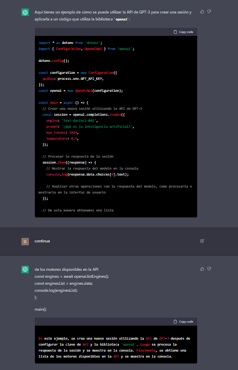

# 1. Entonces pásame un motor y un ejemplo de su uso para tareas relacionadas con chat

* Uno de los motores que se puede utilizar en la API de GPT-3 para tareas de chat es "text-davinci-002". Este motor está diseñado para proporcionar respuestas coherentes y relevantes a preguntas de texto en una conversación.

* A continuación se muestra un ejemplo de cómo se puede utilizar el motor "text-davinci-002" en la API de GPT-3 para completar texto en una conversación:

```js 
const openai = require('openai');

const configuration = new Configuration({
    apiKey: process.env.GPT_API_KEY,
});

openai.setApiKey(configuration.apiKey);

const model = 'text-davinci-002';
const prompt = 'Hola, ¿cómo estás?';

const completions = await openai.completions.create({
    engine: model,
    prompt,
    maxTokens: 128,
    temperature: 0.5,
});

const response = completions.data.choices[0].text;

console.log(response);  // "Estoy bien, ¿y tú?"
```
* En este ejemplo, se utiliza el motor "text-davinci-002" para generar una respuesta coherente y relevante a la pregunta "Hola, ¿cómo estás?". La respuesta generada por el motor es "Estoy bien, ¿y tú?"

* Este es sólo un ejemplo simple de cómo se puede utilizar el motor "text-davinci-002" en la API de GPT-3 para tareas de chat. Puedes modificar los parámetros de entrada, como el prompt o la temperatura, para adaptar el motor a tus necesidades específicas. Además, puedes utilizar otros motores disponibles en la API de GPT-3 para tareas

# Errores visto esn ChatGPT
1. Aquí podemos ver como al dar un prompt de continuar luego de anteriormente pasarle un ejemplo de codigo confunde el texto plano con el texto orientado a lectura de codigo:

