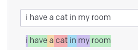

# ¿Qué se busca con este proyecto "Learn to Gpt-3"?
La intención es comprender y realizar diferentes pruebas para el uso y consumo de la API de openIA GPT-3.
Esta API da acceso a modelos que se pueden usar para el procesamiento del lenguaje.

>Lo siguiente serían diferentes conceptos importantes a tener en cuenta para utilizar correctamente esta herramienta:
### Temperatura:
Es un ajuste que permite definir si el modelo tendría resultados idénticos o similares entre sus posibles respuestas. Se puede concluir que la temperatura entre más elevada dará respuestas más variadas.
### Tokens:
Los procesamientos se dividen en unidades pequeñas llamadas tokens

Los tokens normalmente van en palabras cortas y se llegan asub dividir para palabras largas. 
Estos tokens se relacionan en probabildiad con una palabra una relación (Gato es cercano a "Animal"), entre más cercana es el token a esta probabilidad general, más valida es la temperatura para definir si se obitene la probabilidad más alta o si se obtienen otras palabras cercanas relacionadas.

## Creando la aplicación:
* 1. Se clona git clone
> https://github.com/openai/openai-quickstart-node.git 
* 2. Se crea copia de las variables de entorno 
> cp .env.example .env

Por el momento se da a entender que necesita un proyecto de backend para utilizar las variables de entorno sin riesgo

Hay varias acciones que puedes realizar con la constante openai una vez que se ha creado. Algunas de las posibilidades incluyen:

Listar los motores disponibles en la API de GPT-3 con openai.listEngines()
Crear una nueva sesión de GPT-3 con openai.createSession()
Enviar una solicitud de completado de texto a GPT-3 con openai.completions()
Obtener detalles sobre una sesión de GPT-3 existente con openai.getSession()
Eliminar una sesión de GPT-3 con openai.deleteSession()